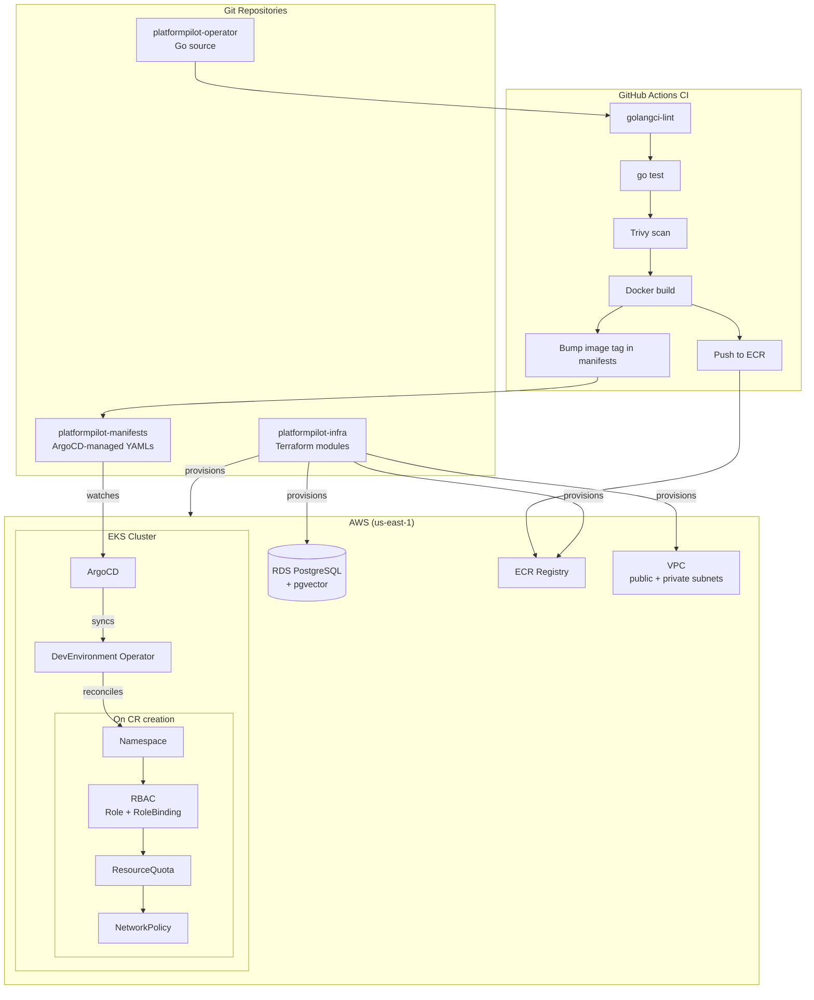

# PlatformPilot

An internal developer platform that provisions isolated Kubernetes environments on demand via a custom Operator, wired up with GitOps-based CI/CD and banking-grade compliance controls on AWS EKS.

## Why this exists

Platform teams spend too much time provisioning environments manually: the same namespace, RBAC bindings, and network policies, reproduced by hand for every team that asks. PlatformPilot treats environment provisioning as a reconciliation problem. A custom Kubernetes Operator watches `DevEnvironment` CRs and drives the cluster toward the declared state, with ordered provisioning, drift detection, and finalizer-based cleanup built into the reconciler.

All infrastructure is managed as code, all deployments are GitOps-driven, credentials are OIDC-federated rather than long-lived keys, and compliance-aware design (Israeli banking Directive 362) is baked into every module.

## Architecture

## Repositories

| Repository | Purpose | Stack |
|---|---|---|
| [platformpilot-operator](https://github.com/yuvalRipkin/platformpilot-operator) | Custom Kubernetes Operator that reconciles `DevEnvironment` CRs into namespaces, RBAC, quotas, and network isolation | Go, Operator SDK, controller-runtime, Prometheus |
| [platformpilot-infra](https://github.com/yuvalRipkin/platformpilot-infra) | Terraform modules for all AWS infrastructure: VPC, EKS managed node groups, RDS PostgreSQL with pgvector extension, ECR | Terraform, AWS (EKS, RDS, VPC, KMS, S3, DynamoDB) |
| [platformpilot-manifests](https://github.com/yuvalRipkin/platformpilot-manifests) | GitOps source of truth: ArgoCD Application CRDs, Helm value overrides, environment-specific patches | YAML, Kustomize/Helm, ArgoCD |
| platformpilot-assistant *(planned)* | RAG-powered Slack bot that answers platform questions by querying ingested runbooks and architecture docs | Python, FastAPI, LangChain, pgvector, Slack Bolt |

## Key technical decisions

**Custom Operator over Helm charts or Terraform.** Helm installs software; an Operator encodes operational knowledge. The `DevEnvironment` reconciler handles drift detection, ordered provisioning (namespace → RBAC → quota → network policy), finalizer-based cleanup, and status conditions. That logic doesn't belong in a Helm hook.

**GitOps with ArgoCD over push-based CD.** Push-based CD embeds cluster credentials in the CI system and creates a direct blast radius from a compromised pipeline. ArgoCD pulls from Git; the cluster's desired state is always inspectable, auditable, and re-convergeable without re-running a pipeline.

**OIDC federation for CI over long-lived access keys.** GitHub Actions OIDC tokens are scoped to a specific repo, branch, and workflow and expire automatically. No AWS credentials are stored as CI secrets, which satisfies Directive 362's access control provisions without a secrets rotation process.

**Separate manifests repo from application source.** Mixing deployment manifests with application source couples build frequency to deployment frequency. A separate manifests repo makes promotion explicit, auditable, and independently versioned.

**pgvector on RDS over a dedicated vector database.** Pinecone and Weaviate add operational surface area for a workload that doesn't justify it at this scale. pgvector on the existing RDS PostgreSQL instance keeps the data perimeter tight: one database, one encryption boundary, one backup policy.

**Terraform over Pulumi or CDK.** The HCL module system maps cleanly to the infrastructure boundaries here (VPC, EKS, RDS, security). CDK and Pulumi introduce a general-purpose programming language where declarative configuration is the better fit.

**Compliance constraints at design time.** Retrofitting encryption, audit logging, and RBAC into running infrastructure is expensive and error-prone. KMS encryption is built into every Terraform module, CloudTrail is enabled by default, and IRSA trust policies are scoped correctly on first deploy.

## Compliance considerations

PlatformPilot is designed with security concerns in mind. This is a design-time constraint that shapes infrastructure decisions, not a compliance certification.

| Requirement | Implementation |
|---|---|
| Encryption at rest | KMS customer-managed keys for EBS, RDS storage, and S3 state backend |
| Encryption in transit | TLS enforced on RDS; HTTPS-only ALB listeners; in-cluster traffic via NetworkPolicy |
| Audit logging | CloudTrail enabled; VPC Flow Logs to S3; K8s audit policy configured on EKS |
| Log retention | S3 lifecycle rules enforce 24-month minimum retention |
| Access control | IRSA for pod-level AWS permissions; RBAC enforced per `DevEnvironment` namespace; no wildcard IAM policies |
| Change management | All changes via Git PR and ArgoCD sync; no manual `kubectl apply` in production paths |

## Roadmap

- [x] Terraform modules: VPC (public + private subnets, NAT Gateway), EKS (managed node groups, IRSA), RDS (PostgreSQL + pgvector, encrypted), ECR
- [x] Remote state backend: S3 + DynamoDB locking
- [x] Kubernetes Operator with `DevEnvironment` CRD, reconciliation loop, finalizers, owner references, status conditions
- [x] GitHub Actions CI: golangci-lint, go test, Trivy container scan, OIDC-federated ECR push
- [x] ArgoCD GitOps: app-of-apps pattern, manifest repo separation
- [ ] RAG Platform Assistant: FastAPI + pgvector + Slack Bolt, Ollama for local LLM
- [ ] Prometheus + Grafana observability stack (cluster health, operator metrics, RAG metrics)
- [ ] OPA/Gatekeeper admission policies

## About

Yuval Ripkin. Backend engineer with 4 years at Bank Hapoalim, now focused on platform engineering and infrastructure. Questions or feedback: yuval.ripkin@gmail.com
