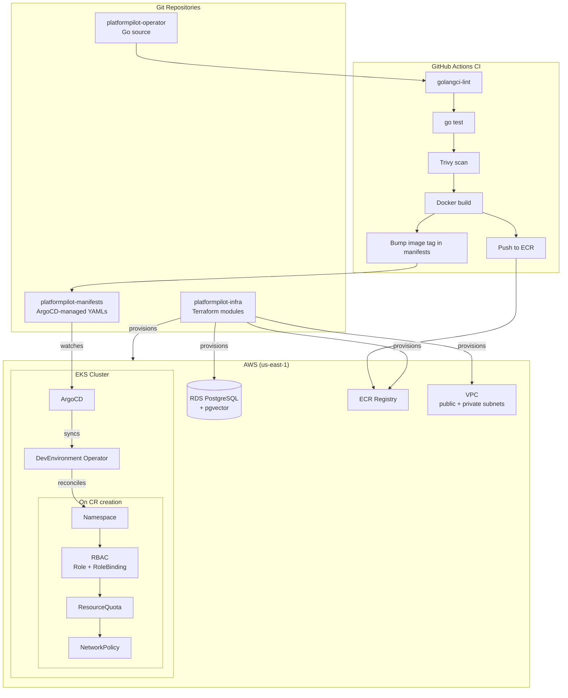

# PlatformPilot

An internal developer platform that provisions isolated Kubernetes environments on demand via a custom Operator, wired up with GitOps-based CI/CD and banking-grade compliance controls on AWS EKS.

---

---

## Why this exists

I'm a backend engineer (Java/Spring Boot, 4 years at Bank Hapoalim) transitioning to Platform Engineering. PlatformPilot is how I'm proving I can build the kind of platform I want to work on — not by following tutorials, but by making the same design tradeoffs a real platform team would face, and living with the consequences.

Every component is built to production standards: all infrastructure is IaC, all deployments are GitOps, credentials are OIDC-federated rather than long-lived keys, and compliance-aware design (Israeli banking Directive 362) is baked in from day one rather than bolted on later.

---

## Architecture

---

## Repositories

| Repository | Purpose | Stack |
|---|---|---|
| [platformpilot-operator](https://github.com/yuvalRipkin/platformpilot-operator) | Custom Kubernetes Operator that reconciles `DevEnvironment` CRs into namespaces, RBAC, quotas, and network isolation | Go, Operator SDK, controller-runtime, Prometheus |
| [platformpilot-infra](https://github.com/yuvalRipkin/platformpilot-infra) | Terraform modules for all AWS infrastructure: VPC, EKS managed node groups, RDS PostgreSQL with pgvector extension, ECR | Terraform, AWS (EKS, RDS, VPC, KMS, S3, DynamoDB) |
| [platformpilot-manifests](https://github.com/yuvalRipkin/platformpilot-manifests) | GitOps source of truth: ArgoCD Application CRDs, Helm value overrides, environment-specific patches | YAML, Kustomize/Helm, ArgoCD |
| platformpilot-assistant *(planned)* | RAG-powered Slack bot that answers platform questions by querying ingested runbooks and architecture docs | Python, FastAPI, LangChain, pgvector, Slack Bolt |

---

## Key technical decisions

- **Custom Operator over Helm charts or Terraform** — Helm installs software; an Operator encodes operational knowledge. The `DevEnvironment` reconciler handles drift detection, ordered provisioning (namespace → RBAC → quota → network policy), finalizer-based cleanup, and status conditions. That logic doesn't belong in a Helm hook.

- **GitOps (ArgoCD) over push-based CD** — Push-based CD embeds cluster credentials in the CI system and creates a direct blast radius from a compromised pipeline. ArgoCD pulls from Git; the cluster's desired state is always inspectable, auditable, and re-convergeable without re-running a pipeline.

- **OIDC federation for CI instead of long-lived access keys** — GitHub Actions OIDC tokens are scoped to a specific repo, branch, and workflow. They expire automatically. There are no AWS credentials stored as CI secrets — a requirement under Directive 362's access control provisions.

- **Separate `manifests` repo from application source** — Mixing deployment manifests with application source creates a feedback loop: every code change triggers a GitOps sync. A separate manifests repo makes promotion explicit, auditable, and decoupled from build frequency.

- **pgvector on existing RDS over a dedicated vector DB** — Pinecone and Weaviate add operational surface area (another service to secure, monitor, and back up) for a workload that doesn't justify it at this scale. pgvector on the existing RDS PostgreSQL instance keeps the data perimeter tight — one database, one encryption boundary, one backup policy.

- **Terraform over Pulumi or CDK** — Terraform is the dominant IaC tool in job postings and the target of the Terraform Associate certification. The HCL module system maps cleanly to the infrastructure boundaries here (VPC, EKS, RDS, security). CDK and Pulumi introduce a programming language abstraction that adds cognitive overhead without solving a real problem at this scope.

- **Compliance from day one, not day ninety** — Retrofitting encryption, audit logging, and RBAC into running infrastructure is expensive and error-prone. Designing with Directive 362 in mind from the start means KMS encryption is baked into every Terraform module, CloudTrail is never an afterthought, and the IRSA trust policies are scoped correctly on first deploy.

---

## Compliance considerations

PlatformPilot is designed with Israeli banking regulatory requirements (Bank of Israel Directive 362) in mind. This is not a compliance certification — it is a design-time constraint that shapes infrastructure decisions.

| Requirement | PlatformPilot implementation |
|---|---|
| Encryption at rest | KMS customer-managed keys for EBS, RDS storage, and S3 state backend |
| Encryption in transit | TLS enforced on RDS; HTTPS-only ALB listeners; in-cluster traffic via NetworkPolicy |
| Audit logging | CloudTrail enabled; VPC Flow Logs to S3; K8s audit policy configured on EKS |
| Log retention | S3 lifecycle rules enforce 24-month minimum retention |
| Access control | IRSA for pod-level AWS permissions; RBAC enforced per `DevEnvironment` namespace; no wildcard IAM policies |
| Change management | All changes via Git PR → ArgoCD sync; no manual `kubectl apply` in production paths |

---

## Roadmap

- [x] Terraform modules: VPC (public + private subnets, NAT Gateway), EKS (managed node groups, IRSA), RDS (PostgreSQL + pgvector, encrypted), ECR
- [x] Remote state backend: S3 + DynamoDB locking
- [x] Kubernetes Operator with `DevEnvironment` CRD, reconciliation loop, finalizers, owner references, status conditions
- [x] GitHub Actions CI: golangci-lint, go test, Trivy container scan, OIDC-federated ECR push
- [x] ArgoCD GitOps: app-of-apps pattern, manifest repo separation
- [ ] RAG Platform Assistant: FastAPI + pgvector + Slack Bolt, Ollama for local LLM
- [ ] Prometheus + Grafana observability stack (cluster health, operator metrics, RAG metrics)
- [ ] OPA/Gatekeeper admission policies
- [ ] CKA certification (target: May 2026)
- [ ] Terraform Associate certification (target: May 2026)

---

## About

I'm Yuval Ripkin — a backend engineer with 4 years at Bank Hapoalim building Spring Boot microservices, now transitioning into Platform Engineering and SRE. I'm looking for roles where I can own infrastructure, build developer tooling, and work with Kubernetes at scale. PlatformPilot is my proof of work.

📧 yuval.ripkin@gmail.com · 🔗 [linkedin.com/in/yuval-ripkin](https://linkedin.com/in/yuval-ripkin)

---

## Checklist for manual verification before publishing

Items I couldn't verify from repo contents — fill these in before sending the link to recruiters:

- [ ] Confirm GitHub username casing: is it `yuvalRipkin` or `yuval-ripkin`? Update all repo links accordingly.
- [ ] Verify `platformpilot-manifests` is the correct repo name (you mentioned this repo recently — confirm it exists and is public).
- [ ] If `platformpilot-operator` has Prometheus metrics implemented, add a specific mention of which metrics (`reconcile_duration_seconds`, `reconcile_errors_total`, `environments_total`) — a concrete metric name is a strong signal.
- [ ] If the operator has unit tests with envtest, add that to the operator row in the repo table.
- [ ] Confirm OIDC federation is implemented in GitHub Actions (vs. access keys). If not yet — remove that bullet from Key Decisions until it's done.
- [ ] Confirm `platformpilot-infra` is public and has the directory structure (`modules/vpc/`, `modules/eks/`, `modules/rds/`). The README assumes this structure.
- [ ] Add your LinkedIn URL once confirmed.
- [ ] Once you have a demo recording (week 7 deliverable), add a `## Demo` section at the top with a GIF or video link — this is the first thing a recruiter with 60 seconds will look for.
